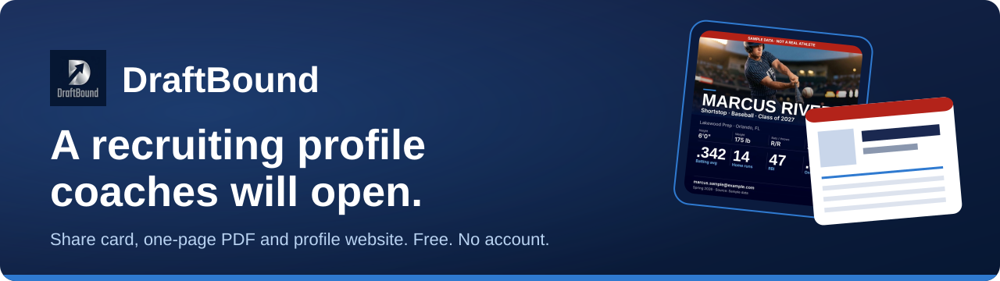
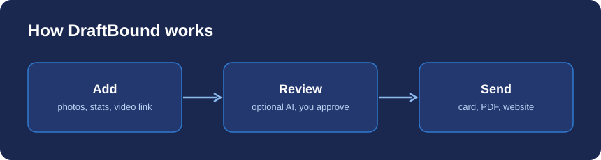
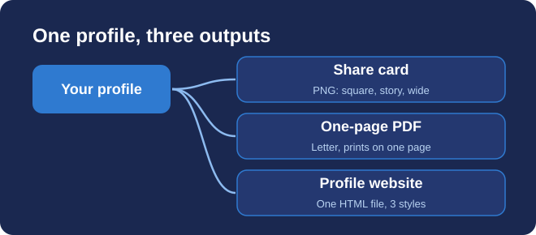
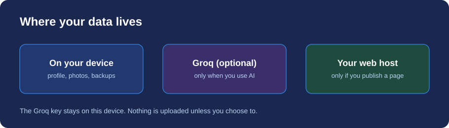

<p align="center"></p>

# DraftBound

A recruiting profile for youth athletes. Turn game photos, stats and a highlight link into a share card, a one-page PDF and a profile website. Free, no account, saved on your device.

- Website: https://johnlaz.github.io/db/
- App: https://johnlaz.github.io/db/app/



## What it makes



| Output | Details |
| --- | --- |
| Share card | PNG in square (1080 × 1080), story (1080 × 1920) and wide (1200 × 630). Optional QR code to the profile page. |
| One-page PDF | Letter portrait, prints on a single page. Made with the browser's Print dialog. |
| Profile website | One self-contained HTML file in three styles (Spotlight, Stat sheet, Narrative). `noindex` by default. |

Only items marked visible appear. Blank fields are left out rather than shown as empty boxes. Exports made from the sample athlete are watermarked.

## Features

- Sport-aware stat templates for 18 sports, plus custom stats and multiple seasons.
- Photos, scoresheet photos and CSV stat exports. Videos are links (YouTube, Hudl, Drive), not uploads.
- Recruiter details: height, weight, bats/throws, GPA, test scores, intended major, contact and reference.
- Persona: off by default. Turn it on, then write your own, start from a template or generate as many options as you want.
- Profile readiness check before you send.
- Several athletes on one device, each with their own data.
- Works offline once installed to the home screen.

## Optional AI (Groq)

AI is optional. Without a key, everything else works.

1. Create a free key at https://console.groq.com.
2. In the app open Settings, then Groq API key, and paste it.
3. Use Test to check the key.

With a key, the app can read CSV stat exports and clear scoresheet photos, tag photos, draft a bio and generate personas. AI only fills blank stats, marks what it filled, and never replaces something you typed. You review everything before it appears on an output.

**Models.** Defaults are `llama-3.3-70b-versatile` (text) and `meta-llama/llama-4-scout-17b-16e-instruct` (photos). In Settings, tap Change on either model to pull the current list from Groq. Refreshing the list never changes your selection. If a saved model disappears from Groq, it stays selected and is flagged so you can choose a replacement.

## Data and privacy



- Profiles live in your browser's IndexedDB on your device.
- The Groq key is kept in local storage on your device and is never included in backups.
- Settings, then Save backup, downloads a file you can restore on another device.
- Nothing is uploaded unless you use AI (text and photos go to Groq) or host an exported page.
- Where an exported page lives and who sees it is up to you.

## Repository layout

```
index.html          Landing page
README.md           This file
docs/               README diagrams (SVG)
assets/             Landing page photos
app/
  index.html        The app (single file)
  manifest.json     PWA manifest
  sw.js             Service worker (cache name carries the version)
  icon-192.png
  icon-512.png
  shot-*.png        Install screenshots (sample data)
```

## Deploy and update

Hosted on GitHub Pages from the repository root. To update, replace the changed files and push.

When you change the app, set `APP_VERSION` (for example `3.0`) in `app/index.html` and `CACHE` in `app/sw.js` to match (`draftbound-v3`). Installed copies pick up the new version on their next online open and show a Reload prompt. The version appears at the bottom of Settings.

## Changelog

**2.0**
- New share card layouts, one-page PDF and profile website that read from one profile model.
- Recruiter details, readiness check, sample mode with watermark, multiple seasons.
- Persona is now a toggle, with unlimited saved and generated personas.
- Model picker that never swaps your choice automatically.
- Honest AI errors, no invented facts, CSV and photo reading only.
- PWA: scoped manifest, maskable icons, install screenshots, versioned cache.
- Fixes: multi-athlete data mix-up, accent color not restored, duplicated functions, unescaped HTML.

## Licence

© 2026 LAZLAB Creations. All Rights Reserved. Contact: lazlab.io@gmail.com

Bundles qrcode-generator 1.4.4 (MIT, © Kazuhiko Arase).
